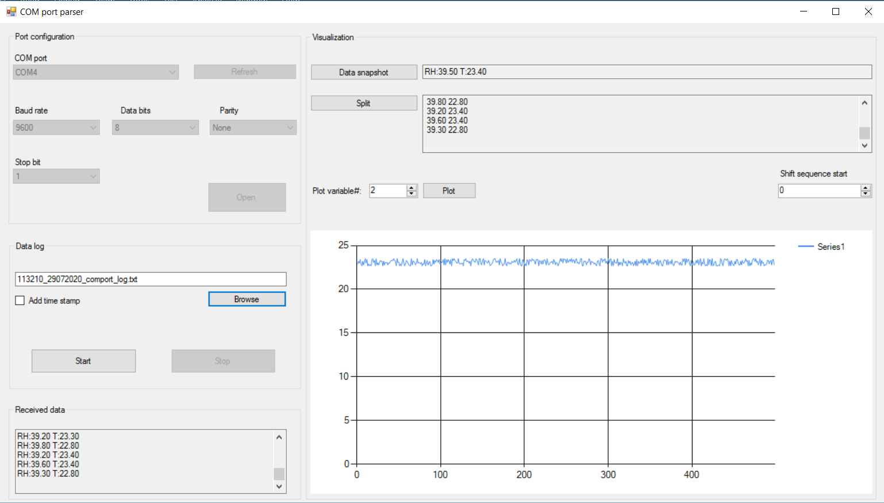

# COM-port-parser
### utility to parse and log messages from COM port

Those who deal with hardware often need to read messages from devices connected to your PC over COM ports. This Windows desktop utility helps to read, log and visualize messages from a COM port.
Here below I'll provide the details of how to use the utility. If you have any specific questions you can reach out to me in my blog https://research-based.blogspot.com/

## COM port settings
This part of UI allows to choose the appropriate settings. First of all select from the list the corresponding COM port your hardware device connected to. Then select appropriate baudrate, number of bits, options for parity and stop bits. Once ready click "Open". The default settings are 9600,8,N,1.

## Data log settings
Once the port is correctly opened the utility can log arriving messages to a .txt file. The default name for the log file is generated automatically as hhmmss_ddmmyyyy_comport_log.txt. You may change the name and directory. Click "Start" to start writing the messages and "Stop" to finish it. You may also add a timestamp to every ariving message by checking the corresponding option. Below is an example of a log file with disabled and enabled timestamp option.

## Arriving messages
Once the port is correctly opened and the messages are arriving they will be displayed as is in the "Received data" window:

This is the basic functionality of the utility. You can set the connection, read, log and print the arriving messages. The additional functionality of the utility allows to plot the numbers from the arriving messages.

## Splitting the arriving message

To enable this functionality click the "Data snapshot" button in the Visualization panel. The utility will pick up a message from the port and display in in a text field. Click "Split" button and an new window will appear. 

Here you can specify how to split the arriving messages into separate numbers. Type a symbol which is used as separator in the message and click "Split". If you want to use several symbols type them in a row without any additional stuff. E.g. if you want to specify two-spot and whitespace as two separators type ": ". You will see the splitted substrings in the table. Now let's consider two cases.

### "Horizontal" case

Let's imagine a connected hardware device is sending messages with the readings of humidity and temperature sensors. Let it in a format be like:

**RH: XX.X T:YY.Y**

where XX.X and YY.Y are float values from the sensors
Every new arriving message contains new readings from the sensors. We want to plot the readings. Then the separator symbols in the example are two-spot ":" and whitespace " ". And after splitting it's possible to choose the variable of interest by modifying the "Mask" row in the table. Imagine, we are interested in both humidity and temperature readings. Let's change the mask value from 0 to 1 in the corresponding cells and click "Apply":

In case of correct splitting a text field will show the numbers of interst (marked in green). Since two variables were selected a corresponding control in UI will allow you to choose the first or the second variable to plot (marked in purple). Select the variable number and click "Plot". The plot will start displaying the variable of interest:

### "Vertical" case

It may happen that the hardware device sends every piece of information as new message. Let's modify the example.Now the messages from the connected device are like:

**Time from start: XX**  
**Relative humidity: YY.Y**  
**Temperature: ZZ.Z**  

Now the received data is like:  
  

Thus by using the splitting from the "horizontal" case the plot will always jump between three values XX, YY and ZZ and of course such visualization doesn't make any sense:

Let's click again the "Split" button, set a separator (":" in this case), modify the mask and select "vertical" option. In the example the device sends three different values and it's one complete cycle. The fourth arrived message is in fact a begining of the next cycle. So, as a parameter "Variables in a cycle" the number "3" shall be specified:

Apply the settings and also set "Plot variable" parameter to "1" and click "Plot". The variable will be plotted:

The last thing is how to switch between three variables in a cycle in the example. In our example every message contains either reading of the humidity sensor or the temperature sensor or the elapsed time. The utility picks up a variable as "first" just by chance. It can be time, humidity or temperature. The control "Shift sequence start" allows to switch between variables in a cycle. 
On the screenshot below three examples are shown. The period in green is when the not appropriate "horizontal" option was set and the plot jumped between time, temperature and humidity. The period in purple is when the right option "vertical" was set and the utility took a variable as "first" by chance (temperature in this case). By using the control "Shift sequence start" in the next period (red) the elapsed time was plotted. And finally using again the same control in the last period (pink) the readings of humidity sensor was plotted:

## Default behaviour
Once you set the port settings and click "Open" the application will try to parse a number in arriving message and plot it. If messages don't contain a number or contain many numbers the plot will be empty with incremented X-axis at every received message. Just ignore it if you are not interested in plotting any variables.  
**NB!** settings in the visualization functionality don't affect the logging process! In case logging is enabled the messages are always logged <ins>as is</ins>
